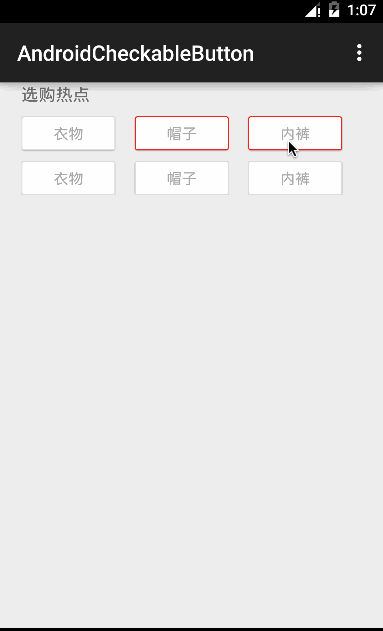

# AndroidCheckableButton

A simple button which implements the `Checkable` interface.

It behaves like a `CheckBox`, but can also be used as a `Button`.

The button behaving like `RadioButton`, and layout behaving like `RadioGroup` will be added soon. :)

Demo
---



Usage
---

The usage of `CheckableButton` is exactly the same as `Button`, but in order to achive the UI of the demo, you need to do a little more work.

**Create two shapes for borders in default and selected status**

*checkable_default_border.xml*

```xml
<?xml version="1.0" encoding="utf-8"?>
<shape xmlns:android="http://schemas.android.com/apk/res/android">
    <stroke android:width="1dp" android:color="#DDDDDD" />
    <corners android:radius="2dp" />
    <solid android:color="@android:color/white" />
</shape>
```

*checkable_selected_border.xml*

```xml
<?xml version="1.0" encoding="utf-8"?>
<shape xmlns:android="http://schemas.android.com/apk/res/android">
    <stroke android:color="#ED2727" android:width="1dp" />
    <corners android:radius="2dp" />
    <solid android:color="@android:color/white" />
</shape>
```

**Create a selector used as the background**

```xml
<?xml version="1.0" encoding="utf-8"?>
<selector xmlns:android="http://schemas.android.com/apk/res/android">
    <item android:state_checked="true" android:drawable="@drawable/checkable_selected_border" />
    <item android:drawable="@drawable/checkable_default_border" />
</selector>
```

**You can also create a color selector for text color**

*checkable_text_color.xml* placed in `res/color` directory.

```xml
<?xml version="1.0" encoding="utf-8"?>
<selector xmlns:android="http://schemas.android.com/apk/res/android">
    <item android:state_checked="true" android:color="@android:color/darker_gray" />
    <item android:state_checkable="true" android:color="@android:color/darker_gray"/>
    <item android:color="@android:color/darker_gray"/>
</selector>
```

**Apply the defined resource files**

```xml
<com.liangfeizc.flowlayout.FlowLayout
    android:layout_width="match_parent"
    android:layout_height="wrap_content"
    android:layout_marginBottom="10dp"
    android:layout_marginTop="10dp"
    app:horizontal_spacing="18dp"
    app:vertical_spacing="10dp">

    <com.liangfeizc.checkablebutton.CheckableButton
        android:layout_width="88dp"
        android:layout_height="32dp"
        android:background="@drawable/checkable_background"
        android:text="衣物"
        android:textColor="@color/checkable_text_color"
        android:textSize="14sp" />

    <com.liangfeizc.checkablebutton.CheckableButton
        android:layout_width="88dp"
        android:layout_height="32dp"
        android:background="@drawable/checkable_background_secondary"
        android:text="帽子"
        android:textColor="@color/checkable_text_color"
        android:textSize="14sp" />
</com.liangfeizc.flowlayout.FlowLayout>
```

Me
---

* [weibo](http://www.weibo.com/liangfeizc)
* [site](http://www.liangfeizc.com)

License
---

    MIT
